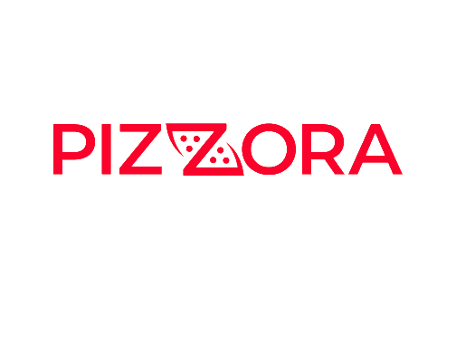

<div align="center">
  
  
  # Pizzora Restaurant
</div>

Welcome to the **Pizzora Restaurant** system! This is a comprehensive, modern web application and management system designed specifically for running a successful restaurant, seamlessly handling everything from customer orders to back-office administration.

## ✨ Features & Functions

This application is divided into robust customer-facing interfaces and powerful management tools.

### 🍕 Customer Experience
- **Interactive Menu & Ordering:** Browse a rich, visually appealing menu with an intuitive cart and checkout process.
- **Table Reservations:** Easily book tables for dining in.
- **Catering Services:** Dedicated module for large catering orders.
- **Order Tracking:** Real-time updates for customers to track their food.
- **Responsive Design:** A beautiful experience across all devices (mobile, tablet, desktop).

### 💼 Restaurant Management & Admin
- **Point of Sale (POS):** Fast and reliable POS system for front-of-house staff.
- **Kitchen Display System (KDS):** Streamlined order management for the kitchen to improve prep times.
- **Table Management:** Live tracking of table statuses and orders.
- **Inventory & Waste Management:** Keep track of stock levels and minimize food waste.
- **Cash Register & Payroll:** Full financial tracking and employee payroll management.
- **Product Analytics:** Deep dive into sales metrics and product performance.
- **Label Printing:** Automated printing for boxes and packaging.

## 🚀 Running the Code

1. Install dependencies:
   ```bash
   npm i
   ```
2. Start the development server:
   ```bash
   npm run dev
   ```

---

<div align="center">
  <strong>Designed and developed by <a href="http://www.rizqara.tech">Rizqara Tech</a></strong><br>
  <a href="http://www.rizqara.tech">www.rizqara.tech</a>
</div>